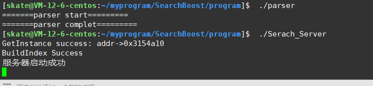

## 运行效果展示

#### 服务端



#### 客户端


## 编译请看我

### 一:boost_devel 库安装(直接yum安装)

` yum install -y boost-devel`

### 二:cppjieba 分词库安装(git安装)

#### 		1.获取链接

`git clone https://github.com/yanyiwu/cppjieba.git`

#### 		2.建立软链接到工作目录下

`ln -s   `

### 三:jsoncpp-devel库安装(yum安装)

`yum install -y jsoncpp-devel`

### 四:cpp-httplib库安装(需要较高版本gcc才可以使用,centos下默认4.8.5)

#### 1.升级gcc到7.3.1

##### (1)查看当前gcc版本是否满足条件,如果满足可以跳过这些步骤,直接安装cpp-httplib


##### (2)升级gcc的方法

```c
用老的编译器，要么编译不通过，要么直接运行报错
搜索：scl gcc devsettool升级gcc
//安装scl
$ yum install centos-release-scl scl-utils-build
//安装新版本gcc
$ sudo yum install -y devtoolset-7-gcc devtoolset-7-gccc++
$ ls /opt/rh/
//启动： 细节，命令行启动只能在本会话有效
$ scl enable devtoolset-7 bash
//可选：如果想每次登陆的时候，都是较新的gcc
$ cat ~/.bash_profile
# .bash_profile
# Get the aliases and functions
if [ -f ~/.bashrc ]; then
. ~/.bashrc
fi
# User specific environment and startup programs
PATH=$PATH:$HOME/.local/bin:$HOME/bin
export PATH
#每次启动的时候，都会执行这个scl命令
scl enable devtoolset-7 bash
```

##### 2.安装cpp-httplib(建议安装0.7.15)

下载链接:https://github.com/yhirose/cpp-httplib/tags?after=v0.8.0


## 下载搜索相关的文档请看我

https://www.boost.org/users/history/version_1_81_0.html


## QQ:859440223

## WeChat:iIl1o0OI